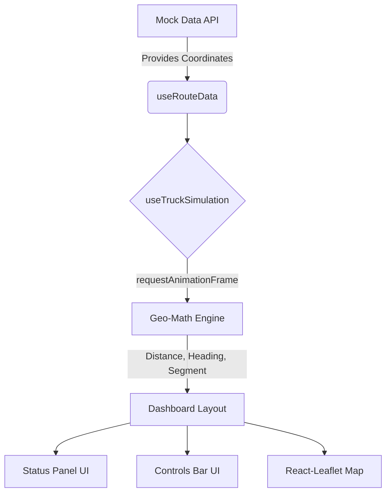

# TransitCheck: Logistics Route Visualizer

 **Live Deployment:** [View the Live Dashboard Here](https://transit-check-beryl.vercel.app/) 

A high-fidelity logistics dashboard built to simulate and track delivery vehicles in real-time. This application provides live geographic telemetry, ETA calculations, and animated coordinate interpolation wrapped in a production-ready SaaS interface.

## Problem Statement
Modern logistics operations require real-time visibility into transit routes. The challenge was to build an interactive frontend dashboard that handles continuous geographic coordinate math and smooth marker animation without dropping frames or blocking the main UI thread, while strictly adhering to a professional enterprise design language.

## Project Requirements
* **Map Integration:** Render a continuous route containing an Origin and 3 Delivery Waypoints.
* **Live Telemetry:** Animate a truck marker moving sequentially along the geographic path.
* **Status Tracking:** Display live metrics including distance covered, current location, next stop, and a fraction of completed stops (e.g., 0/3).
* **Advanced Controls (Bonus):** Implement Pause/Resume functionality and variable playback speeds (1x, 2x, 4x).
* **ETA Calculation (Bonus):** Derive real-time estimated arrival minutes based on remaining distance and a constant vehicle speed.
* **Theme Support (Bonus):** Build a manual Light/Dark mode toggle architecture.

## System Architecture

The application relies on a decoupled React architecture, isolating the highly active animation loop from the presentation components to ensure optimal rendering performance.



**Core Technologies:**
* **Framework:** React + TypeScript + Vite
* **Styling:** Tailwind CSS v4 + Google Inter Typography
* **Mapping:** `react-leaflet` + OpenStreetMap Tiles
* **Mathematics:** Haversine formula distance calculations & bearing interpolation

## Requirement Fulfillment & Implementation

* **High-Performance Animation Loop:** Instead of relying on `setInterval` which causes visual tearing in React, the truck animation is powered by a custom `useTruckSimulation` hook utilizing `requestAnimationFrame`. This loop calculates exact time-deltas to push butter-smooth distance updates at 60fps.
* **Dynamic Geographic Orientation:** Natively calculates the bearing between GPS coordinates to dynamically rotate a custom top-down SVG cargo truck marker, ensuring it always faces its exact driving direction.
* **Enterprise Dashboard Layout:** Shifted from a standard full-screen map to a strict viewport-bounded side-panel layout. Telemetry data and playback controls are fully responsive, stacking cleanly on smaller devices without breaking the map visibility.
* **Stepped State Management:** Filtered continuous distance mathematics through a rounding algorithm to create a rigid, 25% incremental UI progress bar, mimicking real-world carrier logistics tracking.
* **Context-Driven Theming:** Implemented a `ThemeContext` utilizing Tailwind v4's `@variant dark` configuration to instantly swap the entire application between light and dark visual modes without a page reload.

## Local Development

```bash
# Clone the repository
git clone [https://github.com/Shreyansh3108/TransitCheck.git](https://github.com/Shreyansh3108/TransitCheck.git)

# Navigate to the project directory
cd transitcheck

# Install dependencies
npm install

# Start the Vite development server
npm run dev
```
